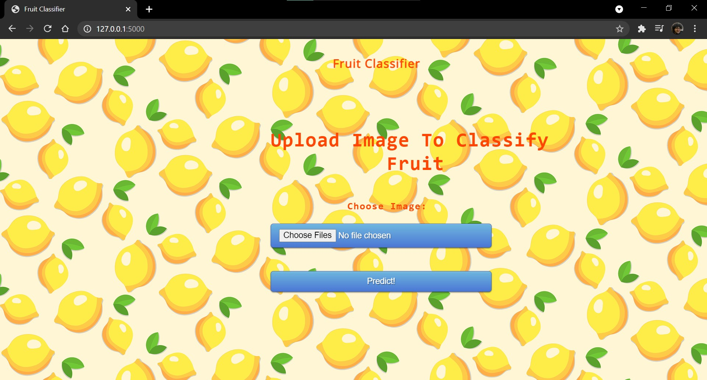
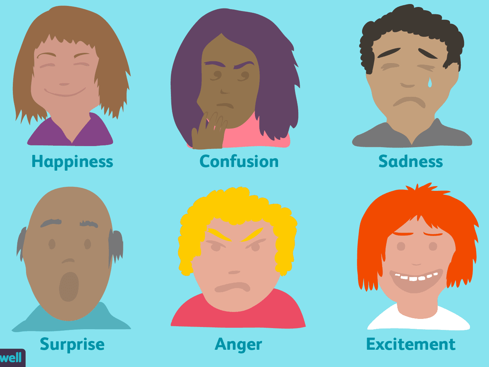

# Deep Learning

We did two projects for deep learning during our course in Semester VI. They are given below.

# [Simple Fruit Classifier](https://github.com/SohamSharangpani/DL_Projects/tree/main/SimpleFruitClassifier-main)

## A CNN based classifier to differentiate between rotten and fresh, apples, bananas and oranges.

   Detecting the rotten fruits become significant in the agricultural industry. Usually, the classification of fresh and rotten fruits is carried by humans is not effectual for the fruit farmers. Human beings will become tired after doing the same task multiple times, but machines do not. Thus, the project proposes an approach to reduce human efforts, reduce the cost and time for production by identifying the defects in the fruits in the agricultural industry. If we do not detect those defects, those defected fruits may contaminate good fruits. Hence, we proposed a model to avoid the spread of rottenness. 
   
   
   The proposed model classifies the fresh fruits and rotten fruits from the input fruit images. In this work, we have used three types of fruits, such as apple, banana, and oranges. A Convolutional Neural Network (CNN) is used for extracting the features from input fruit images, and Softmax is used to classify the images into fresh and rotten fruits. The data is extracted from various sources and produces an accuracy of 93.78%. The results showed that the proposed CNN model can effectively classify the fresh fruits and rotten fruits. In the proposed work, we inspected the transfer learning methods in the classification of fresh and rotten fruits. The performance of the proposed CNN model outperforms the transfer learning models and the state of art methods.
   
## Steps for using it
1. Download the static, templets and app packages and store them under one directory
2. Open command prompt and choose the directory where you stored the above packages
3. Execute python app.py
4. Copy the link given in output and paste it on your default browser
5. Upload the image and test it!

Few images are given under media to test upon

## Example of Classification 

# [Real Time Face Expression Recognition](https://github.com/SohamSharangpani/DL_Projects/tree/main/Facial_Expression_Flask)

Real time recognition of facial expressions using     

## Description
Computer animated agents and robots bring new dimension in human computer interaction which makes it vital as how computers can affect our social life in day-to-day activities. Face to face communication is a real-time process operating at a a time scale in the order of milliseconds. The level of uncertainty at this time scale is considerable, making it necessary for humans and machines to rely on sensory rich perceptual primitives rather than slow symbolic inference processes.  
In this project we are presenting the real time facial expression recognition of seven most basic human expressions: ANGER, HAPPY, NEUTRAL SAD, SURPRISE.  
This model can be used for prediction of expressions of both still images and real time video. However, in both the cases we have to provide image to the model. In case of real time video the image should be taken at any point in time and feed it to the model for prediction of expression. The system automatically detects face using HAAR cascade then its crops it and resize the image to a specific size and give it to the model for prediction. The model will generate seven probability values corresponding to seven expressions. The highest probability value to the corresponding expression will be the predicted expression for that image.
## Business Problem
However, our goal here is to predict the human expressions, but we have trained our model on both human and animated images. Since, we had only approx 1500 human images which are very less to make a good model, so we took approximately 9000 animated images and leverage those animated images for training the model and ultimately do the prediction of expressions on human images.   
For better prediction we have decided to keep the size of each image <b>350*350</b>.  
<b>For any image our goal is to predict the expression of the face in that image out of seven basic human expression</b>
## Problem Statement
<b>CLASSIFY THE EXPRESSION OF FACE IN IMAGE OUT OF FIVE BASIC HUMAN EXPRESSION</b>

## Real-World Business Objective & Constraints
1. Low-latency is required.
2. Interpretability is important for still images but not in real time. For still images, probability of predicted expressions can be given.
3. Errors are not costly.
## How to Run the Model
After downloading data from the aforementioned sources you have to structure the data into separate folders corresponding to the seven class labels. Then you can use the code in the file "FacialExpressionRecognition.ipynb" to train the model. You can add or delete layers in MLP part of the model based on your data and results. Don't forget to save your model after each epoch. 
Then for real time prediction you can run the file "Real_Time_Prediction.ipynb".
## Prerequisites
You need to have installed following softwares and libraries in your machine before running this project.
1. Python 3
2. Anaconda: It will install ipython notebook and most of the libraries which are needed like sklearn, pandas, seaborn, matplotlib, numpy, PIL.
3. OpenCV
4. keras

## Example

### Contributors

- [Parisha Bhatia](https://github.com/ParishaKB) - J008

- [Soham Sharangpani](https://github.com/SohamSharangpani) - J044

- [Avneesh Dubey](https://github.com/avneeshdubey99) - J016

- [Yash Doshi](https://github.com/YASHDOSHI5) - J015

