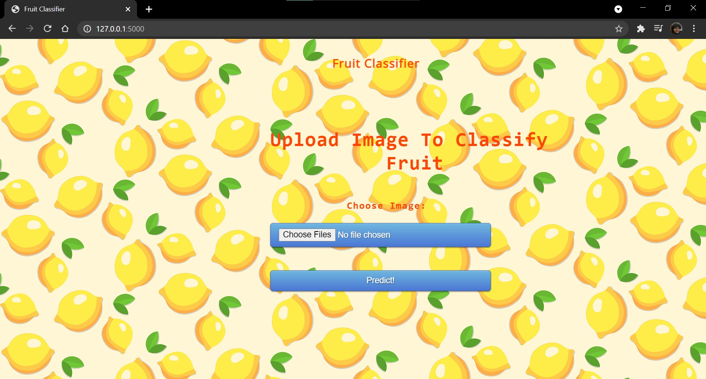

# SimpleFruitClassifier

## A CNN based classifier to differentiate between rotten and fresh, apples, bananas and oranges.

   Detecting the rotten fruits become significant in the agricultural industry. Usually, the classification of fresh and rotten fruits is carried by humans is not effectual for the fruit farmers. Human beings will become tired after doing the same task multiple times, but machines do not. Thus, the project proposes an approach to reduce human efforts, reduce the cost and time for production by identifying the defects in the fruits in the agricultural industry. If we do not detect those defects, those defected fruits may contaminate good fruits. Hence, we proposed a model to avoid the spread of rottenness. 
   
   
   The proposed model classifies the fresh fruits and rotten fruits from the input fruit images. In this work, we have used three types of fruits, such as apple, banana, and oranges. A Convolutional Neural Network (CNN) is used for extracting the features from input fruit images, and Softmax is used to classify the images into fresh and rotten fruits. The data is extracted from various sources and produces an accuracy of 93.78%. The results showed that the proposed CNN model can effectively classify the fresh fruits and rotten fruits. In the proposed work, we inspected the transfer learning methods in the classification of fresh and rotten fruits. The performance of the proposed CNN model outperforms the transfer learning models and the state of art methods.
   
## Steps for using it
1. Download the static, templets and app packages and store them under one directory
2. Open command prompt and choose the directory where you stored the above packages
3. Execute python app.py
4. Copy the link given in output and paste it on your default browser
5. Upload the image and test it!

Few images are given under media to test upon

## Example of Classification 

